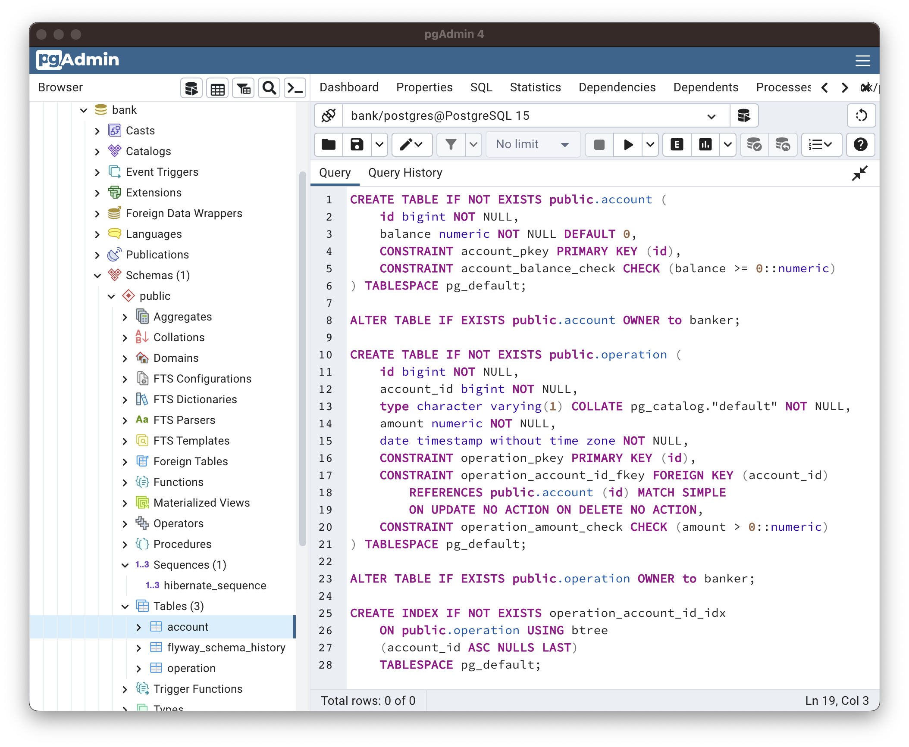

# Demo REST API for banking services

A demo Spring Boot application which allows: 
- to get an account balance,
- to deposit money to an account,
- to withdraw money from an account,

via REST API.

## Endpoints

### /getBalance/{userId}

If a user with such `userId` exists, returns `200 OK` and its current balance 
in a field `result` of the following JSON structure:
```    
    {
        "result": 0.00,
        "message": ""
    }
```
If there is no user with such `userId`, returns `404 Not Found` and the following 
JSON:
```
    {
        "result": -1,
        "message": "user not found"
    }
```

### /putMoney

Receives an instruction in the following JSON structure:
```
    {
        "userId": 1001,
        "amount": 500
    }
```
and returns `200 OK` and the following JSON, if an operation was 
successful:
```
    {
        "result": 1
        "message": ""
    }
```
In case of a user with such `userId` does 
not exist, returns `404 Not Found` and the following JSON:
```
    {
        "result": 0
        "message": "user not found"
    }
```
If there was an error in the request, returns `400 Bad Request` and the 
following JSON:
```
    {
        "result": 0
        "message": "user id is null"
    }
```

### /takeMoney

Similar to `/putMoney` receives an instruction in the following JSON structure:
```
    {
        "userId": 1001,
        "amount": 100
    }
```
and returns `200 OK` and the following JSON in case of success:
```
    {
        "result": 1
        "message": ""
    }
```
If a user with such `userId` does not exist, returns `404 Not Found` 
and the following JSON:
```
    {
        "result": 0
        "message": "user not found"
    }
```
In case of an erroneous request, returns `400 Bad Request` and the
following JSON:
```
    {
        "result": 0
        "message": "user id is null"
    }
```

## Other Endpoints

### /actuator

A Spring Boot Actuator endpoint, returns a list of its endpoints 
which are enabled (`/actuator/health` by default).

### /actuator/health

One ot Spring Boot Actuator endpoint which returns the current 
status of an application.

### /v2/api-docs  

A Swagger 3 endpoint which returns the list of all endpoints. 
A web-version is also available at `/swagger-ui/`.  

## Configuration

An application listens on port 8080, contains Flyway scripts to create 
database structure and two test users with ids 1001 and 1002. Default 
database connection parameters:

| Parameter | Value               |
| --------- |---------------------|
| provider  | PostgreSQL          |
| port      | 5432                |
| database  | bank                |
| username  | (current user name) |
| password  | (no password)       |

All these parameters can be changed by adding `spring.datasource.url`, 
`spring.datasource.username` and `spring.datasource.password` to file 
`db.properties` in the working directory.

Database has to contain a sequence `HIBERNATE_SEQUENCE` and a table
`ACCOUNT` of the following structure:



Or you can use a database dump `dump.sql`.
