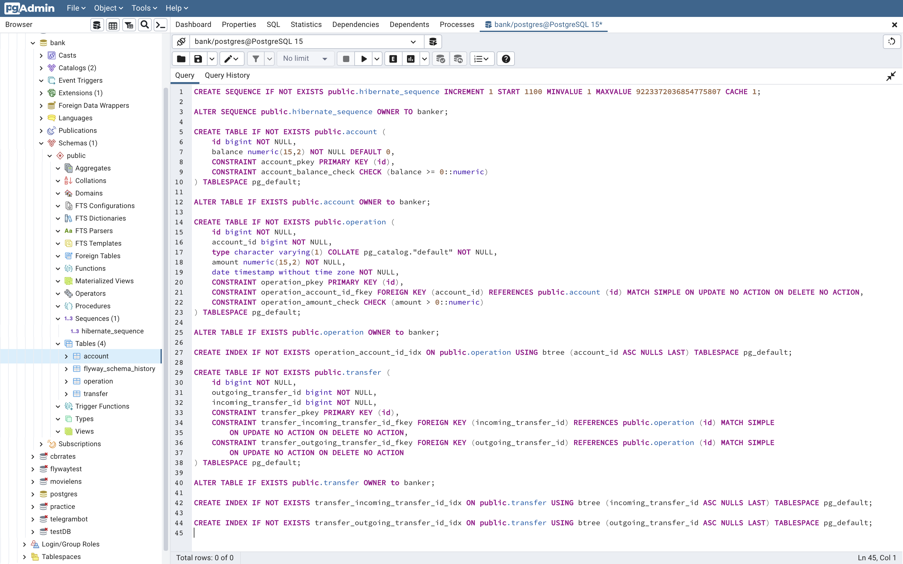

# Demo REST API for banking services

A demo Spring Boot application which allows: 
- to get an account balance,
- to deposit money to an account,
- to withdraw money from an account,
- to transfer money from one account to another one,
- to get an operations history for an account, 

via REST API.

## Endpoints

### /getBalance/{userId}

If a user with such `userId` exists, returns `200 OK` and its current balance 
in a field `result` of the following JSON structure:
```json
{
  "result": 0.00,
  "message": ""
}
```
If there is no user with such `userId`, returns `404 Not Found` and the following 
JSON:
```json
{
  "result": -1,
  "message": "user not found"
}
```

### /putMoney

Receives an instruction in the following JSON structure:
```json
{
  "userId": 1001,
  "amount": 500
}
```
and returns `200 OK` and the following JSON, if an operation was 
successful:
```json
{
  "result": 1,
  "message": ""
}
```
In case of a user with such `userId` does 
not exist, returns `404 Not Found` and the following JSON:
```json
{
  "result": 0,
  "message": "user not found"
}
```
If there was an error in the request, returns `400 Bad Request` and the 
following JSON:
```json
{
  "result": 0,
  "message": "user id is null"
}
```

### /takeMoney

Similar to `/putMoney` receives an instruction in the following JSON structure:
```json
{
  "userId": 1001,
  "amount": 100
}
```
and returns `200 OK` and the following JSON in case of success:
```json
{
  "result": 1,
  "message": ""
}
```
If a user with such `userId` does not exist, returns `404 Not Found` 
and the following JSON:
```json
{
  "result": 0,
  "message": "user not found"
}
```
In case of an erroneous request, returns `400 Bad Request` and the
following JSON:
```json
{
  "result": 0,
  "message": "user id is null"
}
```

### /transferMoney

Receives an instruction in the following JSON structure:
```json
{
  "userId": 1001,
  "receiverId": 1002,
  "amount": 200
}
```
and returns `200 OK` and the following JSON if transfer was successful:
```json
{
  "result": 1,
  "message": ""
}
```
If a user with either `userId` or `receiverId` does not exist, 
returns `404 Not Found` and the following JSON:
```json
{
  "result": 0,
  "message": "receiver not found"
}
```
If there is another error in the request, returns `400 Bad Request` 
and the following JSON:
```json
{
  "result": 0,
  "message": "insufficient balance"
}
```

### /getOperationList/{userId}

If a user with such `userId` exists, returns `200 OK` and a history 
of user operations in the following JSON structure:
```json
[
  {
    "date": "1970-01-01T08:00:00.000+00:00",
    "type": "deposit",
    "amount": 1000.00
  },
  {
    "date": "1970-02-02T08:00:00.000+00:00",
    "type": "withdrawal",
    "amount": 700.00
  }
]
```
If there is no user with such `userId`, returns `404 Not Found` and the following
JSON:
```json
{
  "result": 0,
  "message": "user not found"
}
```
if there are no operations for the user with such `userId`, returns `404 Not Found` 
with a similar JSON:
```json
{
  "result": 0,
  "message": "operations not found"
}
```
User's operation history may be filtered with request parameters `dateFrom` 
and `dateTo` of `yyyy-MM-dd` format:
```
    /getOperationList/1001?dateFrom=1970-01-01&dateTo=1970-12-31
```
Operations, dates of which are equal to `dateFrom`, will be included. And operations 
dated `dateTo` will be excluded. Either `dateFrom` or `dateTo` may be omitted.  

## Other Endpoints

### /actuator

A Spring Boot Actuator endpoint, returns a list of its endpoints 
which are enabled (`/actuator/health` by default).

### /actuator/health

One ot Spring Boot Actuator endpoints which returns the current 
status of an application.

### /v2/api-docs  

A Swagger 3 endpoint which returns the list of all endpoints. 
A web-version is also available at `/swagger-ui/`.  

## Configuration

An application listens on port 8080, contains Flyway scripts to create 
database structure and three test users with ids 1001, 1002, and 1003. 
Default database connection parameters:

| Parameter | Value               |
|-----------|---------------------|
| provider  | PostgreSQL          |
| port      | 5432                |
| database  | bank                |
| username  | (current user name) |
| password  | (no password)       |

All these parameters can be changed by adding `spring.datasource.url`, 
`spring.datasource.username` and `spring.datasource.password` to file 
`db.properties` in the working directory.

Database has to contain a sequence `HIBERNATE_SEQUENCE` and tables
`ACCOUNT`, `OPERATION`, `TRANSFER` (see a database dump `dump.sql` in 
the project directory):



## Running instance

You may test an instance of the application at 
[akunutko.fvds.ru:8080](http://akunutko.fvds.ru:8080)